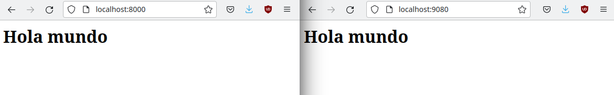

# Tarea: Docker - Trabajando con volúmenes
## 1. Descarga la imagen 'httpd' y comprueba que está en tu equipo
Comenzamos descargando la imagen httpd utilizando el comando `docker pull httpd`. Al no especificar una versión del paquete, se utilizará por defecto la etiqueta `latest`, por lo que se descargará la última versión.
```console
    asir2@A09equipo14:~/Documentos/SRI/Tarea2$ docker pull httpd
    Using default tag: latest
    latest: Pulling from library/httpd
    Digest: sha256:5123fb6e039b83a4319b668b4fe1ee04c4fbd7c4c8d1d6ef843e8a943a9aed3f
    Status: Image is up to date for httpd:latest
    docker.io/library/httpd:latest
```
Comprobamos que se ha descargado mediante el comando `docker images`.
```console
    asir2@A09equipo14:~/Documentos/SRI/Tarea2$ docker images
    REPOSITORY    TAG       IMAGE ID       CREATED        SIZE
    httpd         latest    359570977af2   5 days ago     168MB
    httpd         2.4       7860e7628717   2 weeks ago    168MB
```
## 2. Crea un contenedor con el nombre 'asir_httpd'
## 3. Mapea el puerto 80 del contenedor con el puerto 8000 de tu máquina
## 4. Utiliza bind mount para que el directorio del apache2 'htdocs' esté montado un directorio que tú elijas
Para crear el contenedor ejecutamos el comando `docker run -dit --name asir_httpd -p 8000:80 -v "$PWD"/htdocs:/usr/local/apache2/htdocs/ httpd:latest`
* `run` especifica que queremos arrancar un contenedor
* `-dit` para que se arranque en segundo plano, manteniendo STDIN abierto y que le adjudique una pseudo-TTY
* `--name` para darle el nombre deseado, en este caso `asir_httpd`
* `-p 8000:80` mapea el puerto 80 del contenedor con el 8000 del host
* `-v "$PWD"/htdocs:/usr/local/apache2/htdocs/` monta la carpeta /usr/local/apache2/htdocs/ del contenedor en la carpeta htdocs dentro del directorio actual
* `httpd:latest` para espeficiar la imagen que queremos utilizar
Comprobamos que se ha creado y se está ejecutando mediante el comando `docker ps`
```console
    asir2@A09equipo14:~/Documentos/SRI/Tarea2$ docker ps
    CONTAINER ID   IMAGE          COMMAND              CREATED          STATUS          PORTS                                   NAMES
    dd5e04b72af2   httpd:latest   "httpd-foreground"   56 seconds ago   Up 55 seconds   0.0.0.0:8000->80/tcp, :::8000->80/tcp   asir_httpd
```
## 5. Realiza un 'hola mundo' en html y comprueba que accedes desde el navegador
Accedemos al directorio `htdocs` donde se aloja la raíz del servidor web y creamos un fichero llamado `index.html' en su interior. Lo abrimos con cualquier editor (VSCode, por ejemplo) y pegamos el siguiente código:
```console
<html>
    <body>
        <h1>Hola mundo</h1>
    </body>
</html>
```
Si intentamos acceder al servidor con nuestro navegador utilizando la dirección `localhost:8000` vemos que se muestra el código recién creado.


## 6. Crea un contenedor 'asir_web1' que use este mismo directorio para 'htdocs' y el puerto 8000
## 7. Utiliza Code para hacer un hola mundo en html
Paramos el contenedor anterior ejecutando `docker stop asir_httpd`.
Para crear el contenedor ejecutamos el comando `docker run -dit --name asir_web1 -p 8000:80 -v "$PWD"/htdocs:/usr/local/apache2/htdocs/ httpd:latest`.
Como ya tenemos creado anteriormente con el Code un `index.html` con el "Hola mundo", se nos mostrará al abrir `localhost:8000` en el navegador.
## 8.Crea otro contenedor 'asir_web2' con el mismo directorio y a otro puerto, por ejemplo 9080.
## 9. Comprueba que los dos servidores 'sirven' la misma página, es decir, cuando consultamos en el navegador http://localhost:9080 y http://localhost:8000:
## 10. Tienen que salir la misma página web
Para crear el contenedor ejecutamos el comando `docker run -dit --name asir_web2 -p 9080:80 -v "$PWD"/htdocs:/usr/local/apache2/htdocs/ httpd:latest`.
Ahora tenemos dos servidores que muestran la misma web alojada en el mismo directorio. Si accedemos a ambas direcciones, podemos ver en el navegador la misma página web.

